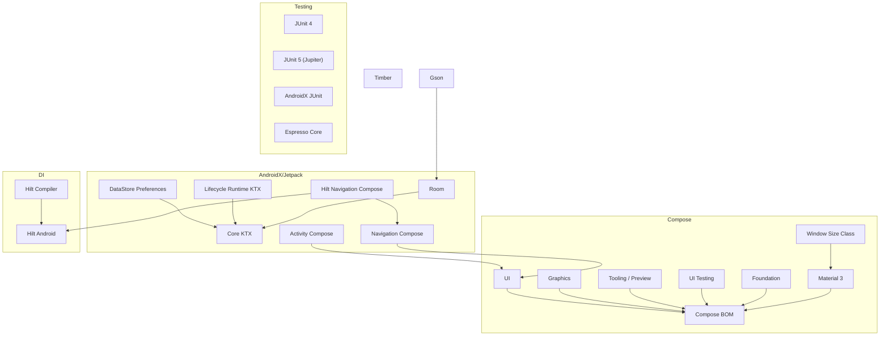

# 📦 Dependencias del Proyecto

Este documento describe las librerías y plugins utilizados en el proyecto, junto con su propósito, versión y enlaces a documentación oficial.

---

## ⚙️ Plugins de compilación

* **Android Gradle Plugin**
  ID: `com.android.application` — v8.13.0
  👉 Plugin principal para compilar y empaquetar aplicaciones Android.
  🔗 [Documentación](https://developer.android.com/build)

* **Kotlin Android**
  ID: `org.jetbrains.kotlin.android` — v2.2.10
  👉 Permite el uso de Kotlin en proyectos Android.
  🔗 [Kotlin en Android](https://developer.android.com/kotlin)

* **Kotlin Compose**
  ID: `org.jetbrains.kotlin.plugin.compose` — v2.2.10
  👉 Habilita la integración de Jetpack Compose en proyectos Kotlin.
  🔗 [Compose Compiler Plugin](https://developer.android.com/jetpack/compose/setup)

* **Dagger Hilt**
  ID: `com.google.dagger.hilt.android` — v2.57.1
  👉 Plugin para configurar automáticamente Hilt en proyectos Android.
  🔗 [Hilt Android](https://dagger.dev/hilt/)

* **Google KSP**
  ID: `com.google.devtools.ksp` — v2.2.10-2.0.2
  👉 Procesador de anotaciones moderno que reemplaza a KAPT.

  > La versión de `com.google.devtools.ksp` depende fuertemente de la versión de Kotlin.
  > 🔗 [Tabla oficial de compatibilidad](https://github.com/google/ksp/releases)

---

## 🖥️ UI y Compose

* **Activity Compose**
  `androidx.activity:activity-compose` — v1.10.1
  👉 Permite integrar actividades con Jetpack Compose.
  🔗 [Documentación](https://developer.android.com/jetpack/androidx/releases/activity)

* **Compose BOM**
  `androidx.compose:compose-bom` — v2025.08.01
  👉 Asegura la compatibilidad de versiones entre módulos de Compose.
  🔗 [Compose BOM](https://developer.android.com/jetpack/compose/bom)

* **Compose UI**

  * `androidx.compose.ui:ui`
  * `androidx.compose.ui:ui-graphics`
  * `androidx.compose.ui:ui-tooling`
  * `androidx.compose.ui:ui-tooling-preview`
    👉 Conjunto de librerías base para crear interfaces gráficas con Compose.
    🔗 [Compose UI](https://developer.android.com/jetpack/compose)

* **Compose Testing**

  * `androidx.compose.ui:ui-test-manifest`
  * `androidx.compose.ui:ui-test-junit4`
    👉 Herramientas para pruebas unitarias y de instrumentación en Compose.
    🔗 [Testing en Compose](https://developer.android.com/jetpack/compose/testing)

* **Compose Foundation**
  `androidx.compose.foundation:foundation`
  👉 Componentes básicos como layouts, listas y gestos.
  🔗 [Compose Foundation](https://developer.android.com/jetpack/androidx/releases/compose-foundation)

* **Compose Material3**
  `androidx.compose.material3:material3`
  👉 Implementación de Material Design 3 para Compose.
  🔗 [Compose Material3](https://developer.android.com/jetpack/androidx/releases/compose-material3)

* **Material3 Window Size Class**
  `androidx.compose.material3:material3-window-size-class`
  👉 Ayuda a crear diseños responsivos según el tamaño de pantalla.
  🔗 [Window Size Class](https://developer.android.com/jetpack/compose/layouts/adaptive)

---

## 🔄 Ciclo de vida y navegación

* **Lifecycle Runtime KTX**
  `androidx.lifecycle:lifecycle-runtime-ktx` — v2.9.3
  👉 Extensiones Kotlin para manejar el ciclo de vida de componentes.
  🔗 [Lifecycle](https://developer.android.com/jetpack/androidx/releases/lifecycle)

* **Navigation Compose**
  `androidx.navigation:navigation-compose` — v2.9.3
  👉 Navegación declarativa entre pantallas con Compose.
  🔗 [Navigation Compose](https://developer.android.com/jetpack/compose/navigation)

---

## 🛠️ Inyección de dependencias

* **Hilt Android**
  `com.google.dagger:hilt-android` — v2.57.1
  👉 Framework de inyección de dependencias recomendado para Android.
  🔗 [Hilt](https://developer.android.com/training/dependency-injection/hilt-android)

* **Hilt Compiler**
  `com.google.dagger:hilt-compiler` — v2.57.1
  👉 Genera el código necesario para que Hilt funcione.
  🔗 [Dagger Hilt](https://dagger.dev/hilt/)

* **Hilt Navigation Compose**
  `androidx.hilt:hilt-navigation-compose` — v1.2.0
  👉 Integración de Hilt con Jetpack Navigation y Compose.
  🔗 [Hilt Navigation Compose](https://developer.android.com/jetpack/androidx/releases/hilt)

---

## 💾 Persistencia de datos

* **DataStore Preferences**
  `androidx.datastore:datastore-preferences` — v1.1.7
  👉 Reemplazo moderno y seguro de SharedPreferences.
  🔗 [DataStore](https://developer.android.com/topic/libraries/architecture/datastore)

* **Room**

  * `androidx.room:room-runtime`
  * `androidx.room:room-compiler`
  * `androidx.room:room-ktx`
  * `androidx.room:room-paging`
    👉 Librerías de persistencia de datos con SQLite bajo el estándar de Jetpack.
    🔗 [Room](https://developer.android.com/jetpack/androidx/releases/room)

* **Gson**
  `com.google.code.gson:gson` — v2.13.1
  👉 Librería para serialización y deserialización de JSON.
  🔗 [Gson GitHub](https://github.com/google/gson)

---

## 📋 Utilidades

* **AndroidX Core KTX**
  `androidx.core:core-ktx` — v1.17.0
  👉 Extensiones de Kotlin que simplifican el uso de la API de Android.
  🔗 [Core KTX](https://developer.android.com/jetpack/androidx/releases/core)

* **Timber**
  `com.jakewharton.timber:timber` — v5.0.1
  👉 Librería ligera para logging más flexible que `Log.d`.
  🔗 [Timber GitHub](https://github.com/JakeWharton/timber)

---

## 🧪 Testing

* **JUnit 4**
  `junit:junit` — v4.13.2
  👉 Framework de pruebas unitarias clásico.
  🔗 [JUnit 4](https://junit.org/junit4/)

* **JUnit AndroidX**
  `androidx.test.ext:junit` — v1.3.0
  👉 Extensión de JUnit para pruebas en Android.
  🔗 [AndroidX Test](https://developer.android.com/jetpack/androidx/releases/test)

* **JUnit Jupiter (JUnit 5)**
  `org.junit.jupiter:junit-jupiter` — v5.13.4
  👉 Nueva generación de JUnit con características avanzadas.
  🔗 [JUnit 5](https://junit.org/junit5/)

* **Espresso Core**
  `androidx.test.espresso:espresso-core` — v3.7.0
  👉 Framework para pruebas de UI en Android.
  🔗 [Espresso](https://developer.android.com/training/testing/espresso)

* **Mockito**
  `org.mockito:mockito-core` — v5.19.0
  👉 Framework de imitación de objetos para pruebas unitarias.
  🔗 [Mockito](https://site.mockito.org)

---

## 📊 Diagrama de dependencias (Mermaid)

